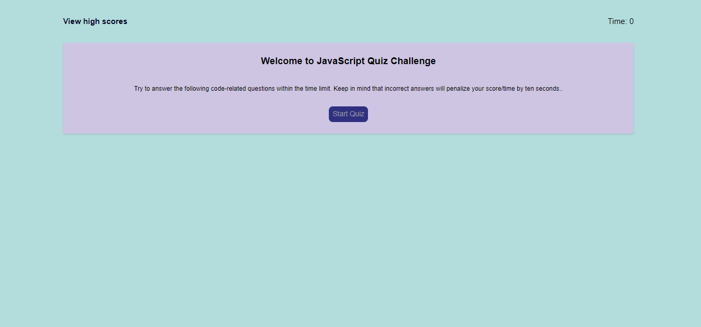
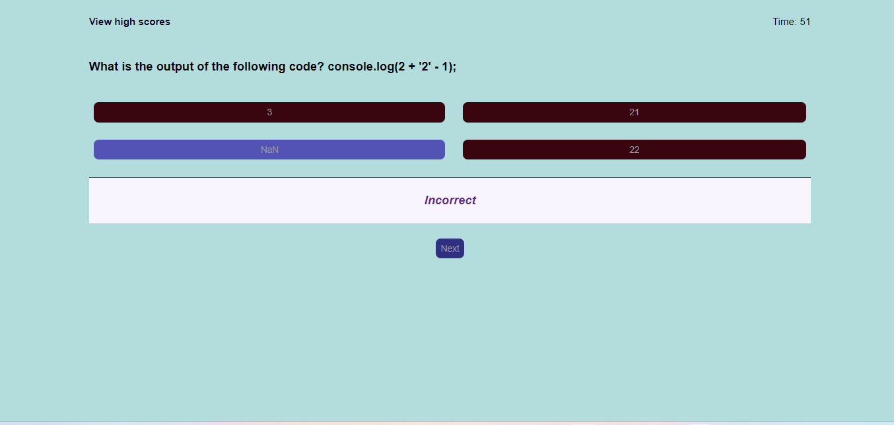
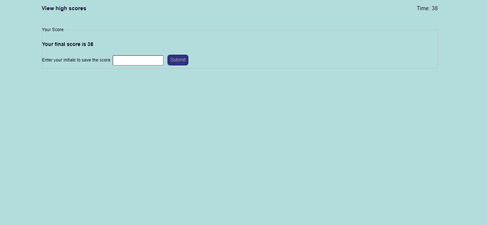

# Javascript-App

This is a simple quiz app built using JavaScript, HTML, and CSS. It presents the user with five JavaScript questions and includes a timer. Each incorrect answer deducts 10 seconds from the timer, and the final score is displayed on a scoreboard.

## Features

- Five JavaScript questions with multiple-choice options
- Timer that counts down with each question
- Incorrect answers deduct 10 seconds from the timer
- Final score displayed on a scoreboard

# Images of the application

URL to github repo
https://github.com/hineeraja/Javascript-App

deployed website URL

